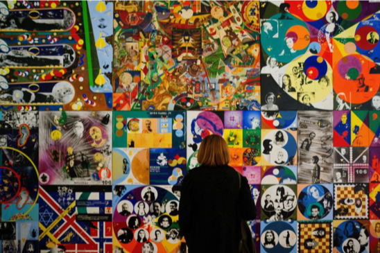
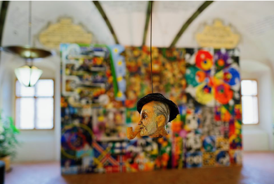
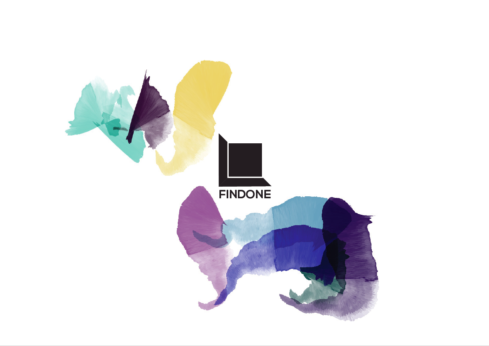
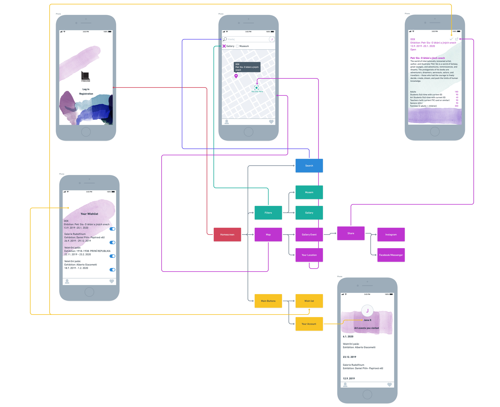
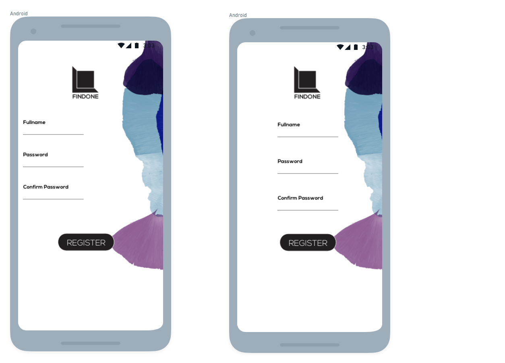

# Prototype of a Mobile App

As a graphic designer student, I should be able to learn, how to work in a graphic industry, which not includes only a logo itself, but also an overall visual communication. I was given a task to create a prototype of a mobile app, that suppose to solve any kind of problem in art industry.

I wanted to create an app, which would search a local galleries and museums around you and give you recommendations. This would help you with any kind of decision-making, which art movement you like and which don’t. It would be a lot easier for you to know, what kind of art galleries/museums are around you. 

So I decided to visit an art gallery myself and try to find out, what is wrong and how to fix the problem with my “future app”. I went to Jihlava Movie Festival Art Gallery and this is what I came with:

**Information**
- poor promotion of the exhibition, no information about the exhibition: (what is the main idea and direction of the exhibition, biography of the author, ...)
- some information was traceable only on the facebook pages of the Jihlava Movie Festival, in terms of promoting the exhibition, the idea was not apparent at all 

`Jihlava Movie Festival Art Gallery`

`Jihlava Movie Festival Art Gallery`

**Solution**

App:
- a map focused on the local galleries / museums / archives
- localizable by the visitor
- informative description of the local exhibition (biography of the artist, artistic direction of the exhibition, general idea of ​​the exhibition)
- reviews by previous visitors of the exhibition  (better feedback)
- much better acquaintance with the exhibition
- the visitor knows in advance what he is getting into

I created logo right at the beginning - it represents the idea of “find the one gallery, that suits your style” or "find the one for you" = **“findone”**

`Findone logo`

`Visual style`

**User testing process**

**negative**
1. Login / Registration Screen
- logo and button centered, other parameters are asymmetrical = align everything to the center or left
- small gaps between registration and login data
2. Spaces and font size
- spacing is too large between individual events (inconsistent, unsorted)
- unnecessarily large dates and spaces in the "Art Events you visited" section
- username too small
3. Typographic imperfections, negligence
4. Incorrectly aligned buttons in the "Your wish list" section

**positive**
- minimalistic visual style with a few distinctive elements
- notification on current event are very useful 
- section "Art events you visited" - respondents described it as completely motivating, a great overview of WHEN and WHAT respondents visited
- overall good impression

**feedback**

`BEFORE AFTER`

`Prototype of Findone Mobile App`

<video controls src="video/findone-preview-app.mp4">

[Findone preview.](https://janakaufmanova.github.io/english-for-designers/02-intentional-aboutness/case-study)

</video>
  

