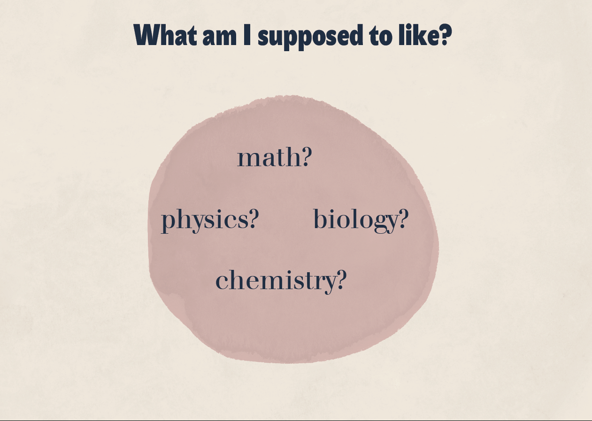
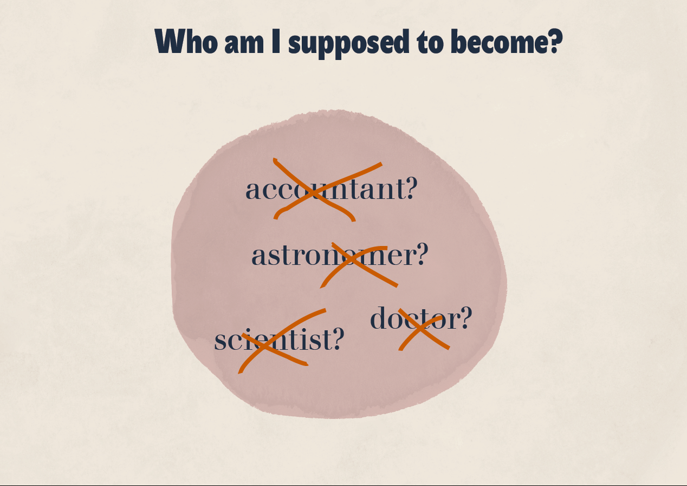
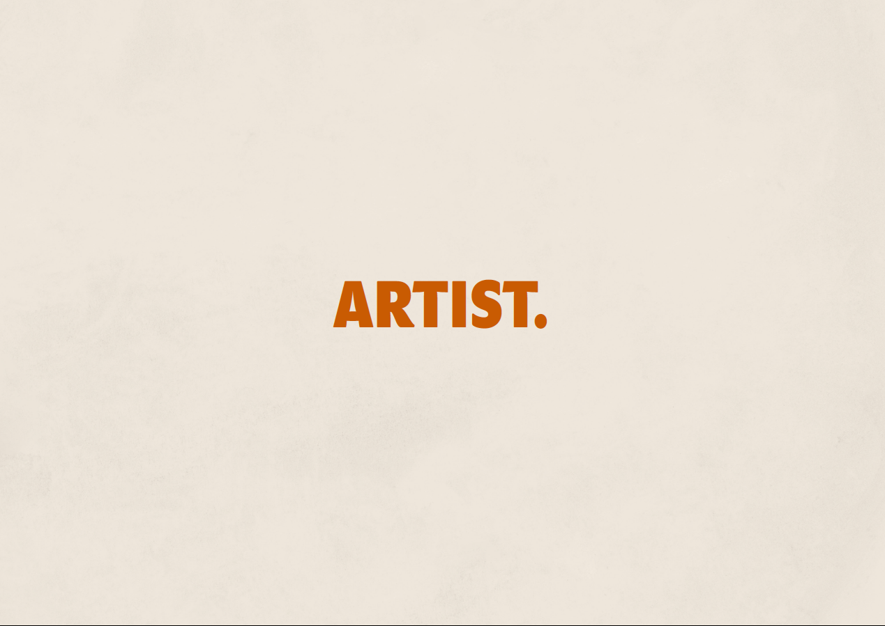
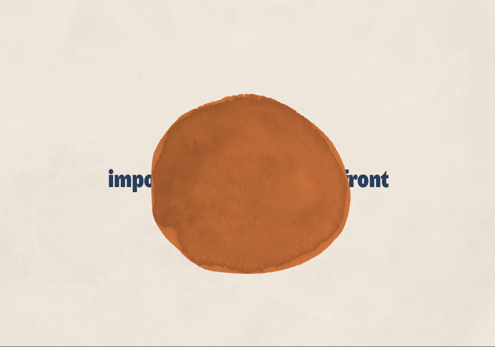
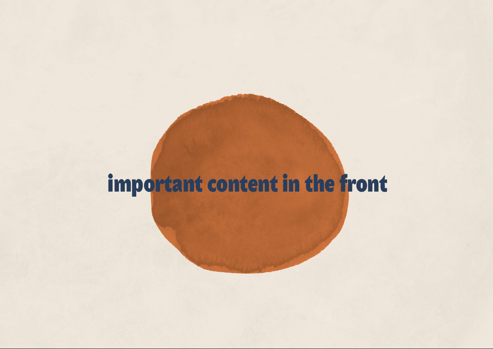
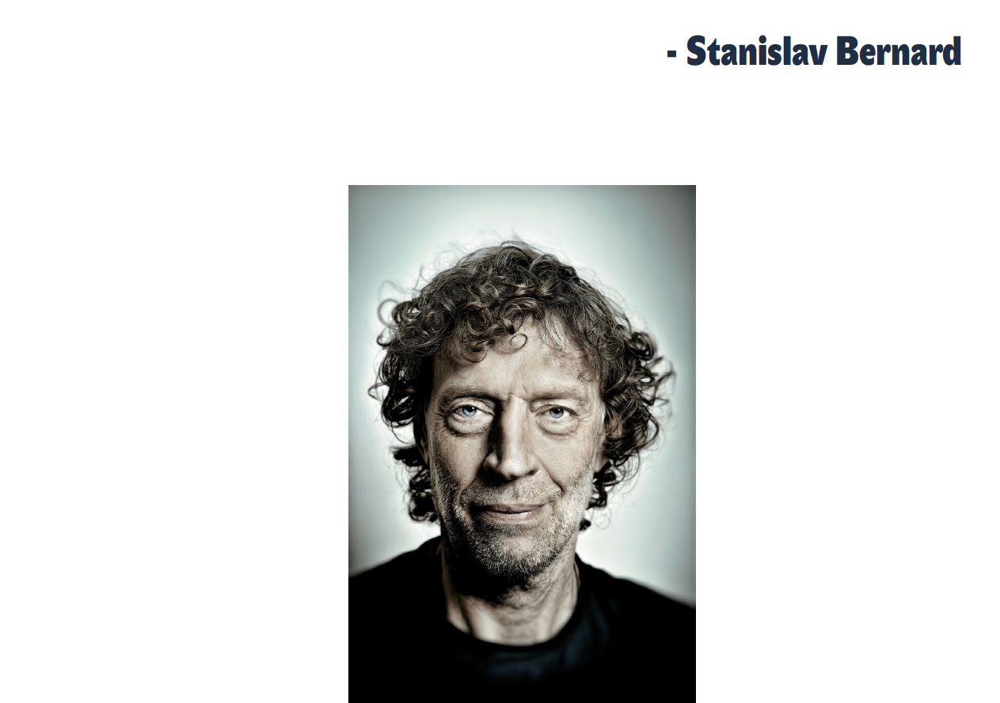
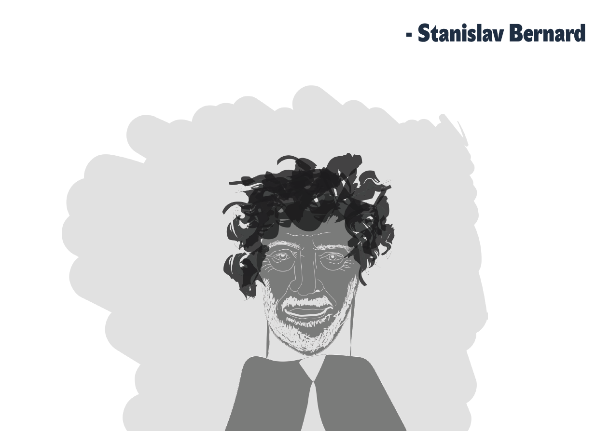

## 1. THE VERY BEGENNING  

I would like to tell you a story about me and why I actually came up with the idea, that i wanted to become a graphic designer and be a part of the art industry overall. I I would like to tell you what I stand for as a graphic designer and what I really enjoy doing as a designer.  

I grow up in a very industrial part of the Czech Republic, where ART is a unknown/ forbidden word. People surrounded by me are either iron factory workers, or engineers, doctors, maybe teachers. I considered myself as person, who didn’t belong anywhere and who didn’t wanted to become any of those professions. 

Everything started in high school, where I didn’t know what to do with myself. I was always trying to understand math, or physics, but it was never enough. I didn’t have the best grades from those subjects, I put a lot of effort in those years in vain. I have already knew, that i never become an engineer. 

It was my graduation year, when I finally opened my eyes and realized, that math and physics is as much important as subjects like: history and art. That was the true me. I didn’t even noticed  it throughout the years. It was time to go out of my comfort zone.

## 2.  UNIVERSITY

It’s been exactly 3 years since I devoted myself to graphic design and I decided to go to university. I had to catch up on a lot of things, but it was the right decision to make. During these three years, I have identified which art styles, typography and type of illustrations I like. 
This is the time, when I educated myself and fell in love with minimalism.

## 3. MINIMALISM

At the beginning I wasn't sure, what minimalism stands for in a graphic industry. I have always thought that minimalism is typical for it's flat  and boring stuff, with no point of view. But I was wrong. The key for minimalism is to bring the most important content to the front and reduce distraction for the user. So If a design has too many elements it can be difficult to understand where to look and what is the main purpose of the design. That’s why I love those minimal, content focused designes - you provide mainly information that has style and clarity. It is a design that breathes, it is uncluttered and it is unique in it’s simplicity, elegance. It has one graphic element that brings the attention. Nothing more. You don’t even have a chance to be lost in it and think about it too much. 

## 4. ILLUSTRATIONS 

I really enjoy drawing illustrations that are messy, freehand, spontaneous, impresice, ... When I started learning, how to draw in the university, I've always thought, that everything is about how precise you are. If you would be able to draw an illustration as good as a black and white photo, you would be the best! 
But I was also kind of wrong. I think that drawing is about how you see things differently and what kind of style you prefer. It's about your emotions you put in there. 
So if you are not able to draw as good as a black and white photo like me, nothing happens. It is not about that. 

## 5. NEW ME

When I look back at my high school memories, it makes me think about how scared I was to do something differently than others. I was always trying to fit perfectly even if I didn't enjoy it. Now I see it clearly. 

