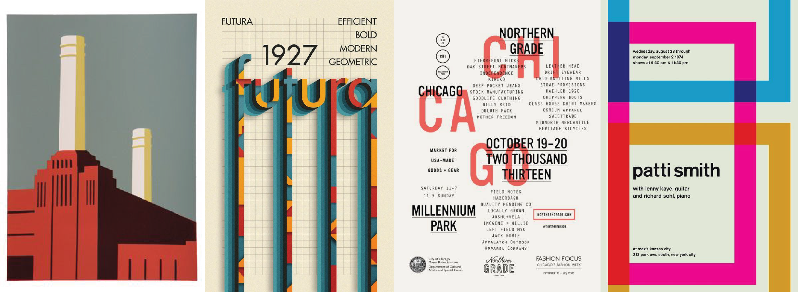
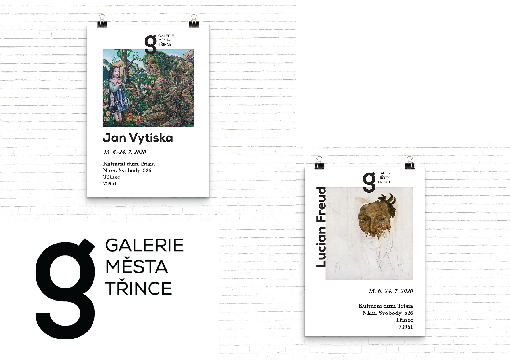

# Corporate Identity design of Třinec Gallery

The aim of this work is to analyse a visual identity of The Art Gallery of Třinec and to redesign it. 

The theoretical part of the thesis is first defining the concept of graphic design, which is one of the crucial concepts in creating visual and communication identity of any institution. The thesis furthermore analyses and compares czech and foreign cultural institutions, also being located in industrial regions as Třinec is, and it will analyse whether their visual communication in the segment is functioning and what are possible differences between the institutions and their communications. For this purpose, the method of so-called SWOT analysis is used, which is used to select the marketing strategy of the Gallery of Třinec, by defining strengths and weaknesses, opportunities and threats in the given context.

The practical part focuses on creating a functioning unified visual style that will be suitable for this segment and will serve as an element to communicate with the inhabitants of the city and the region and will be suitable for raising awareness of the cultural industry in the Třinec region.

The aim of my bachelor thesis is to unify the industrial and artistic visual identity, which would communicate well in a given market segment. With this work, I would like to raise awareness of the gallery in society and focus on communication with local people who come into at least contact with art. The final visual solution should help to elevate The Art Gallery of Třinec to a better quality level, and at the same time support the cultural industry, which is not widespread in the Třinec region.

Keywords: brand, visual identity, graphic design, gallery, cultural industry, metallurgy.

## Why I chose Visual Indentity of Třinec Gallery as my thesis statement

My bachelor's thesis focuses on the complete visual identity of The Art Gallery of Třinec. In my opinion, gallery in Třinec is not using its full potential like other cultural institutions. Třinec is located in a very industrial region, in which the cultural industry is overshadowed by metallurgy and industrial production. I chose the topic of my bachelor's thesis on the basis of personal experience, which I had struggled with over the part years, and I therefore easily noticed this issue. Třinec is my hometown, where I spent many years, so I easily identified with the topic and communication with the gallery's curator was enriching for me. The client was aware of the absence of a visual identity, which she had tried to solve in vain several times. The main condition was to preserve the visual identity in a simple form that would correspond to the artistic content. The gallery does not yet have any comprehensive rules that would work in terms of visual and communication strategy.

`Current Gallery logotype`

## Inspiration 

I was looking for an inspiration to create an industrial visual identity. It wasn't easy right at the begenning, because a wasn't sure, how much industriality I want to bring to the visual identity of the gallery. I wanted to represent art also. 

## First attempt

I created a logotype, that wasn't working well. The typography was too simple and it didn't represent the institution like I wanted. I wanted to create a new visual identity that would reflect the reality of the town and its industrial spirit. I was working with only one industrial symbol - a hook. With the help of my other classmates, we decided that this visual style is not enough and that I would have struggles of defending it at the final exams.

## Direction

The idea of the whole visual indentity lies in the connection of industry and art. The whole concept is based on a detailed analysis of the inhabitants of Třinec, who work in this industrial environment on a daily basis. The questionnaires show that the main identifying elements of Třinec are mainly Třinecké železárny (Ironworks) associated with a heavy industry. Art is therefore underestimated and very often overlooked in this industry. The target members of the Třinec Gallery are therefore residents whose culture is foreign and inaccessible. With this proposed visual style, I want to achieve that it is the combination of these two completely different counterparts that can work with each other and address the citizens of Třinec in a unique and completely atypical way.

The overall concept of a unified visual style is based on the industriality of the city, which is dominated by Třinecké železárny. The main distinguishing feature of Třinecké železárny are hammers that justify the metallurgical industry. This symbol appears both on the logo of Třinecké železárny and on the Třinec emblem itself. It can therefore be considered the main identifying element of Třinec.

## Second and final attempt

The symbolic representation of the hammer also becomes part of the new industrial visual style of the Třinec City Gallery. The letter t corresponds to the shape of a hammer and at the same time justifies the name of the city in which the gallery is located. The connecting element of the logo is also the letter g, which represents the gallery and addresses the target group.
The most important element of the logo and the whole visual style lies in the gap that is located between these two main symbols. This gap symbolizes the gap between the public and art, which the Třinec City Gallery is trying to fill.

