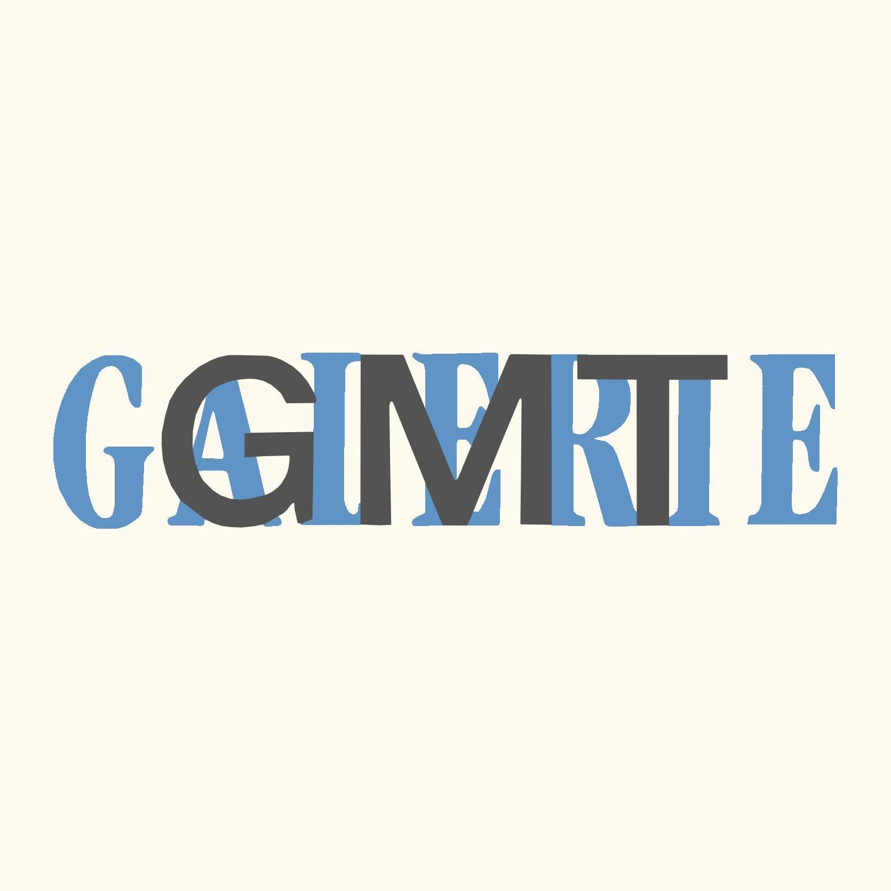

# Corporate Identity design of Třinec Gallery

The aim of this work is to analyse a visual identity of The Art Gallery of Třinec and to redesign it. 

The theoretical part of the thesis is first defining the concept of graphic design, which is one of the crucial concepts in creating visual and communication identity of any institution. The thesis furthermore analyses and compares czech and foreign cultural institutions, also being located in industrial regions as Třinec is, and it will analyse whether their visual communication in the segment is functioning and what are possible differences between the institutions and their communications. For this purpose, the method of so-called SWOT analysis is used, which is used to select the marketing strategy of the Gallery of Třinec, by defining strengths and weaknesses, opportunities and threats in the given context.

The practical part focuses on creating a functioning unified visual style that will be suitable for this segment and will serve as an element to communicate with the inhabitants of the city and the region and will be suitable for raising awareness of the cultural industry in the Třinec region.

Keywords: brand, visual identity, graphic design, gallery, cultural industry, metallurgy.

## Why I chose Visual Indentity of Třinec Gallery as my thesis statement

My bachelor's thesis focuses on the complete visual identity of The Art Gallery of Třinec. In my opinion, gallery in Třinec is not using its full potential like other cultural institutions. Třinec is located in a very industrial region, in which the cultural industry is overshadowed by metallurgy and industrial production. I chose the topic of my bachelor's thesis on the basis of personal experience, which I had struggled with over the part years, and I therefore easily noticed this issue. Třinec is my hometown, where I spent many years, so I easily identified with the topic and communication with the gallery's curator was enriching for me. The client was aware of the absence of a visual identity, which she had tried to solve in vain several times. The main condition was to preserve the visual identity in a simple form that would correspond to the artistic content. The gallery does not yet have any comprehensive rules that would work in terms of visual and communication strategy.

`Gallery logotype`
